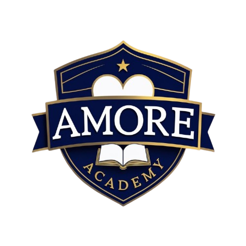

<div align="center">



# 🏫 Amore Academy

### *"Shaping Minds, Building the Future"*


A fully responsive, multi-page fictional school website for **Amore Academy** — a K-12 institution based in Metro Manila, Philippines. Built from scratch with vanilla HTML, CSS, and JavaScript.

</div>

---

## ✨ Features

- 📱 **Fully Responsive** — mobile, tablet, and desktop layouts with a mobile bottom tab bar
- 🎞️ **Scroll Animations** — intersection observer-driven fade-in and reveal effects
- 🔢 **Animated Stat Counters** — numbers count up on scroll into view
- 🖼️ **Hero Parallax** — subtle parallax scroll effect on the home hero section
- 📌 **Sticky Subnav** — per-page sticky sub-navigation that highlights the active section
- 🗂️ **Tab Switching** — SPA-style tab navigation on multi-section pages
- 📋 **Application Form** — multi-step online application on `apply.html`
- ⚖️ **Legal Hub** — unified Privacy Policy, Terms of Use & Accessibility page

---

## 📸 Pages

| Page | File | Description |
|---|---|---|
| 🏠 Home | `Home.HTML` | Hero, quick links, stats, programs preview, news |
| 🏫 About | `about.html` | School history, mission & vision, core values |
| 📚 Academics | `academics.html` | JHS & SHS programs, tracks & strands |
| 📋 Admissions | `admissions.html` | Enrollment requirements & procedure |
| ✏️ Apply | `apply.html` | Online application form |
| 📰 News | `news.html` | News & announcements |
| ⚖️ Legal | `legal.html` | Privacy Policy, Terms of Use, Accessibility |

---

## 📊 School At a Glance

<div align="center">

| 🎓 Students | 👨‍🏫 Faculty | 📈 Graduate Success Rate | 🏆 Years of Excellence |
|:---:|:---:|:---:|:---:|
| **5,000+** | **300+** | **95%** | **50+** |

</div>

---

## 🏫 About the School *(Fictional)*

**Amore Academy** was founded in the early **1970s** by a group of dedicated educators in Metro Manila. Starting with fewer than 200 students, it has grown into a community of over **5,000 learners** — offering complete Junior High School and Senior High School programs under the Philippine K-12 curriculum.

### 🎯 Mission
> *"Amore Academy is committed to providing holistic, values-based education that empowers every learner to achieve academic excellence, develop strong moral character, and become a responsible and compassionate member of society."*

### 👁️ Vision
> *"Amore Academy envisions itself as a premier institution of learning in the Philippines — recognized for producing graduates who are globally competitive, deeply rooted in Filipino values, and equipped to lead with integrity and purpose."*

### 💎 Core Values

| Value | Description |
|---|---|
| 🤝 **Service** | Compassion in action — caring for school, community, and nation |
| 🏅 **Honor** | Upholding dignity and treating others with respect |
| ✅ **Integrity** | Honesty and ethics in academics and in life |
| ⭐ **Excellence** | Giving one's best in all pursuits |
| 🔒 **Loyalty** | Steadfast commitment to the Amorean community |

---

## 📚 Senior High School Tracks & Strands

| Track | Strands |
|---|---|
| 🔬 **Academic** | STEM · ABM · HUMSS · GAS |
| 💼 **TVL** | ICT · Home Economics · Industrial Arts |
| 🎨 **Arts & Design** | Visual Arts · Performing Arts |
| 🏅 **Sports** | Sports Science · Coaching |

---

## 🎨 Design System

| Token | Value |
|---|---|
| **Primary** | `#0A2463` — Navy Blue |
| **Accent** | `#FB8500` — Orange |
| **Accent Light** | `#FFB347` |
| **Background** | `#F5F7FA` — Light Gray |
| **Font – Display** | Crimson Pro |
| **Font – Body** | DM Sans |

---

## 🗂️ CSS Architecture

CSS is modularized into a global base file + per-page stylesheets:

```
main.css           ← design tokens, reset, navbar, footer, shared utilities
├── home.css       ← hero, quick links, programs grid, news preview
├── about.css      ← page hero, sticky subnav, timeline, mission/vision cards
├── academics.css  ← track cards, strand tags, program detail overlays
├── admissions.css ← requirements tables, enrollment steps
├── apply.css      ← multi-step application form
├── news.css       ← news grid, featured card, article cards
└── legal.css      ← legal tabbed layout, policy sections
```

---

## 📁 Project Structure

```
amore-academy/
│
├── 📄 Home.HTML
├── 📄 about.html
├── 📄 academics.html
├── 📄 admissions.html
├── 📄 apply.html
├── 📄 news.html
├── 📄 legal.html
│
├── 🟨 script.js
│
├── 🎨 main.css
├── 🎨 home.css
├── 🎨 about.css
├── 🎨 academics.css
├── 🎨 admissions.css
├── 🎨 apply.css
├── 🎨 news.css
├── 🎨 legal.css
│
└── 📁 image/
    ├── Amore_Academy_Logo.png
    └── ...
```

---

## 🛠️ Tech Stack

| Technology | Usage |
|---|---|
| **HTML5** | Semantic markup, accessibility attributes |
| **CSS3** | Custom properties (design tokens), BEM-inspired naming, Grid & Flexbox |
| **Vanilla JS** | Scroll animations, tab switching, subnav highlight, counter animation, parallax |

> ⚡ Zero external dependencies — no frameworks, no libraries, no build tools.

---

## 📬 Contact *(Fictional)*

📍 123 Excellence Avenue, Education City, Metro Manila
📞 (02) 8123-4567
📧 info@amoreacademy.edu.ph

---

<div align="center">

**⚠️ Disclaimer:** This is a fictional school website created for academic and portfolio purposes. All school names, events, people, and addresses are fabricated.

<br/>

Made with ❤️ for Amore Academy

</div>
